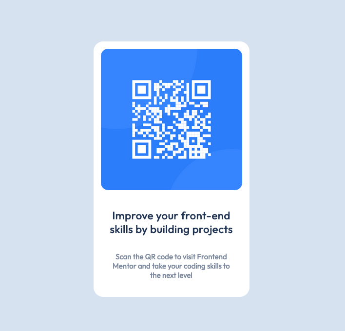
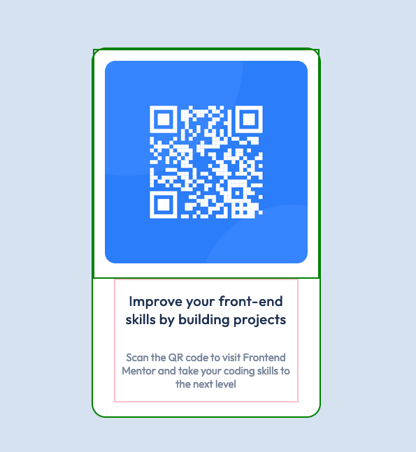

# Frontend Mentor - QR code component solution

This is a solution to the [QR code component challenge on Frontend Mentor](https://www.frontendmentor.io/challenges/qr-code-component-iux_sIO_H).
Frontend Mentor challenges help you improve your coding skills by building realistic projects. 

## Table of contents

- [Overview](#overview)
  - [Screenshots](#screenshot)
  - [Links](#links)
- [My process](#my-process)
  - [Built with](#built-with)
  - [What I learned](#what-i-learned)
  - [Continued development](#continued-development)
  - [Useful resources](#useful-resources)
- [Author](#author)
- [Acknowledgments](#acknowledgments)

## Overview

A basic QR code page to practise HTML, CSS, VSCode & Github.

### Screenshots

I noticed, that it helped me to put borders on the different divs/sections of the page. Without them it was more difficult for me to recognize dome of the alignings and paddings. Of course I removed them before submitting (at least I hope I did...).

### Links

- Solution URL: [Solution](https://www.frontendmentor.io/solutions/qr-code-with-html-css-d44N3PGDNf)
- Live Site URL: [GitHub page](https://leeruska.github.io/QR-code-component/)

## My process

It had been a while since I made the basics of HTML & CSS. So this project was a good way to dig up the information from my head (and many, many websites).
I started by checking setting up my VSCode and Github.
Then I checked what kind of projects others have done, and I started from there.
Can't say many things about my code, but I feel like I should try to do this later on, when I have learnt more.

### Built with

- HTML
- CSS
- Google fonts
- googling, copy-pasting and modifying

### What I learned

I learned, that I need to study and practise more!
I should also remenber that using visual help (the borders) can help, especially when learning new things.
VSCode was also new for me, I have tried it only once before.

### Continued development

I will do a recap to my previous HTML & CSS courses. I still need more understanding on the basic stuff, and I need to practise and do more projects.

### Useful resources
- [Codecademy] (https://www.codecademy.com/learn) - Codecademy, which has free and paid courses for HTML, CSS + many more!
- [CSS cheatsheet](https://www.codecademy.com/learn/learn-css/modules/syntax-and-selectors/cheatsheet) - Cheatsheet for CSS in Codecademy
- [HTML cheatsheet](https://www.codecademy.com/learn/learn-html/modules/learn-html-elements/cheatsheet) - Cheatsheet for HTML in Codecademy

## Author

- GitHub - [@Leeruska](https://github.com/Leeruska)
- Frontend Mentor - [@Leeruska](https://www.frontendmentor.io/profile/Leeruska)

## Acknowledgments

The solutions that I checked the most:
- [@Mightyboar7447] (https://www.frontendmentor.io/solutions/my-qr-code-attempt-hF9lc0inva)
- [@tiago-forward] (https://www.frontendmentor.io/solutions/frontend-mentor-qr-code-component-f3nqvS6TH9)
- [@BoldlyCodingNowhere] (https://www.frontendmentor.io/solutions/qrcode-component-built-with-html-and-css-noaq5FaRtq)
